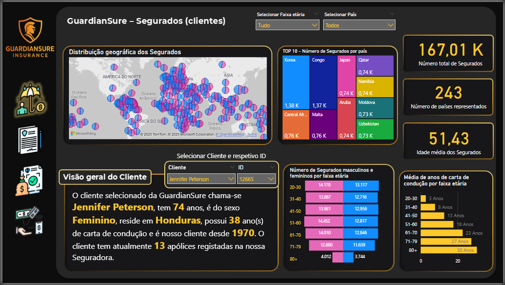
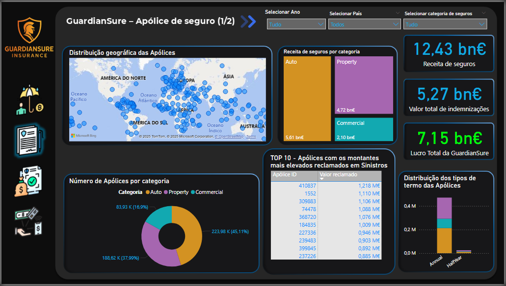
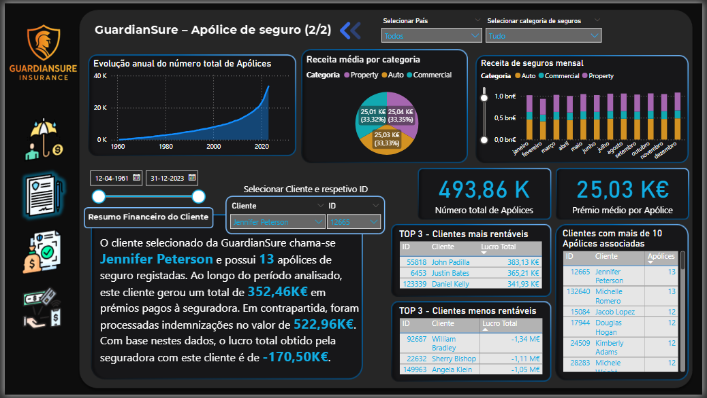
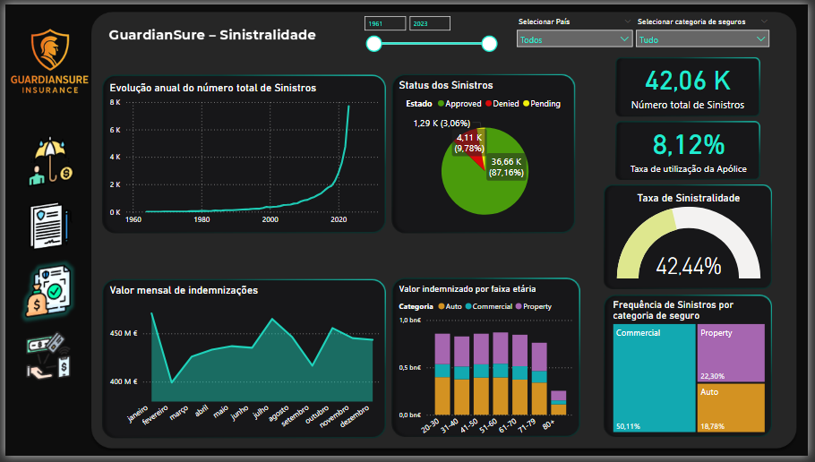
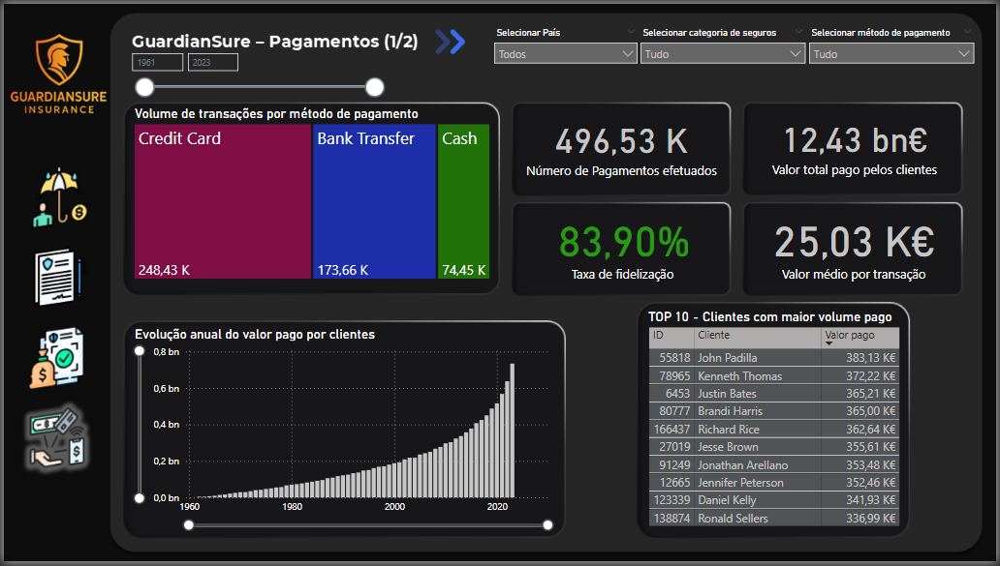

# GuardianSure, a Business Intelligence Dashboard

Interactive Power BI analytics system built for **GuardianSure**, a fictitious insurance company, as the final project for the Business Intelligence course of my MSc in Computer Engineering at UTAD.

This was a team assignment (5 students). I acted as project manager and lead technical contributor, coordinating the team's workflow and planning, and driving execution across every phase myself, from requirements gathering and data modeling to the DAX measures and the final dashboard design.

## 🎯 Objective

Turn GuardianSure's raw operational data (policies, policyholders, claims and payments) into an interactive analytics system that supports decision making, with dynamic dashboards, clear KPIs, and a data model built on Microsoft's BI stack (Power Query, SSAS, Power BI).

## 🧱 Approach

1. **Requirements**, defining the business questions, indicators and KPIs for each data area before touching the data.
2. **Data preparation**, cleaning and transforming the source data with Power Query (consistency checks, calculated columns, table merges).
3. **Data modeling**, building a Star Schema tabular model in **SQL Server Analysis Services (SSAS)**, with fact tables (Claims, Payments, PolicyDetails) and dimension tables, and writing the DAX measures behind every KPI.
4. **Dashboards**, designing the Power BI report with interactive maps, treemaps, cards, "Enlighten Data Story" narratives, and cross-filtering between pages.

## 📊 Dashboards

**Policyholders**, showing geographic distribution, demographics, and a per-client narrative summary.

**Policies (1/2)**, showing revenue, claims paid and profit by category, top policies by claimed amount.

**Policies (2/2)**, showing historical growth, monthly revenue, and most/least profitable clients.

**Claims**, showing claims evolution, status breakdown, loss ratio and indemnity trends.

**Payments**, showing payment methods, retention rate, and top clients by paid volume.

## 📈 Key results

- 167K+ policyholders across 243 countries
- 493K+ active policies, €12.4M+ in premium revenue
- 42K+ claims, 42.44% loss ratio
- 496K+ payment transactions, 83.9% client retention rate

## 🛠️ Tech Stack

  
  
  
  
  

## 📂 Repository contents

- `GuardianSure - Power BI.pbix`, the full Power BI report (data model + dashboards)
- `ssas-model/`, the SSAS tabular model project (`.smproj`, `.bim`)
- `Relatório do Projeto Final - GuardianSure.pdf`, the full project report, in Portuguese
- `assets/`, dashboard screenshots used in this README

## 👤 About

Part of my portfolio. See my [GitHub profile](https://github.com/linho22w) for more projects in AI/ML and backend development.
